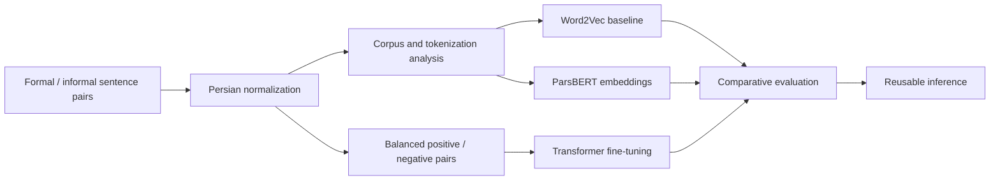

<div align="center">

# Formal-Informal Persian Semantic Equivalence

**From Persian normalization and tokenization analysis to ParsBERT fine-tuning and inference**

[](https://github.com/Mahdi-Jadidi/persian-semantic-equivalence/actions/workflows/ci.yml)


</div>

## Overview

Informal Persian changes spelling, morphology, spacing, and word forms while often preserving meaning. This project measures that representation gap and trains a classifier to decide whether a formal and colloquial sentence are semantically equivalent.

## Results

| Metric | Held-out score |
|---|---:|
| Accuracy | **0.8934** |
| Macro precision | **0.9112** |
| Macro recall | **0.8934** |
| Macro F1 | **0.8923** |

Macro metrics are reported because negative pairs and linguistic variation can hide class-specific errors behind accuracy alone.

## Research workflow



## Highlights

- Character and spacing normalization designed for Persian text.
- Subword fragmentation and token-inflation analysis across registers.
- Static Word2Vec similarity and contextual ParsBERT baselines.
- Deterministic balanced-pair generation with shuffled hard negatives.
- Train/validation/test evaluation and a command-line prediction path.

## Data contract

| Field | Default column | Description |
|---|---|---|
| Formal sentence | `formalForm` | Standard written Persian |
| Informal sentence | `informalForm` | Colloquial or conversational equivalent |

Both column names are configurable from the CLI.

## Quick start

```bash
git clone https://github.com/Mahdi-Jadidi/persian-semantic-equivalence.git
cd persian-semantic-equivalence
pip install -e .
persian-equivalence analyze --data-path trainset_40k_onlySent.xlsx --output-dir outputs/analysis
persian-equivalence train --data-path trainset_40k_onlySent.xlsx --output-dir outputs/model
persian-equivalence predict --model-dir outputs/model --formal "..." --informal "..."
```

## Repository layout

The package separates normalization, tokenization, Word2Vec, transformer embeddings, pair construction, training, evaluation, and inference under `src/persian_semantic_equivalence`.

## Limitations

Randomly shuffled negatives may be easier than naturally occurring semantic confusions. Future evaluation should include human-curated hard negatives, dialect-specific slices, and robustness checks for code-switching and spelling noise.
